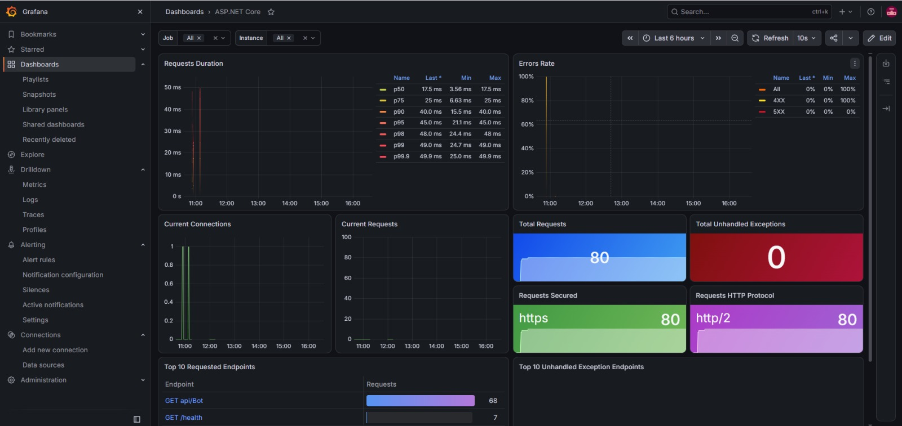
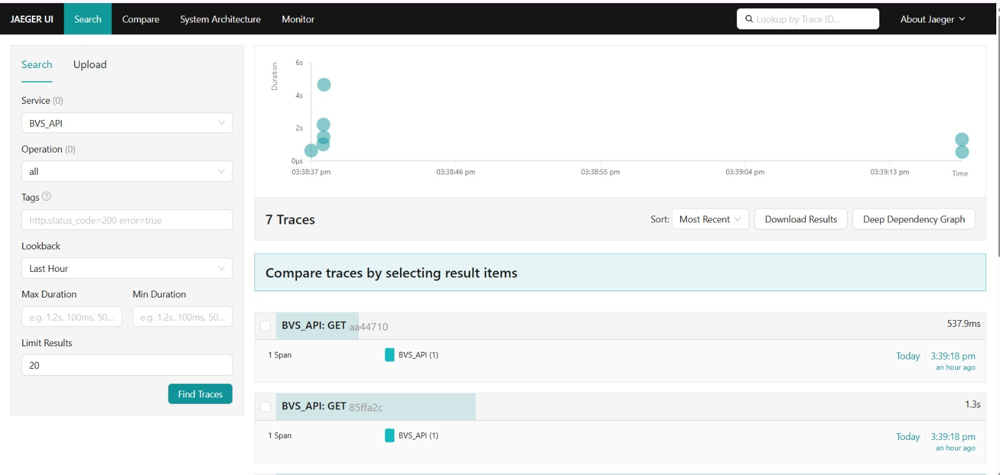
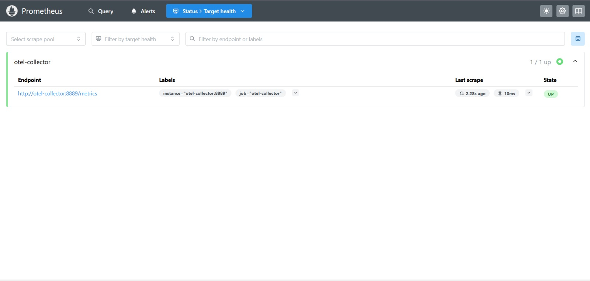

# OpenTelemetry Observability Stack for ASP.NET Core

This project demonstrates a complete OpenTelemetry-based telemetry pipeline using Docker Compose. It collects application telemetry from an ASP.NET Core service, routes it through an OpenTelemetry Collector, and exports it to multiple backends for traces, logs, and metrics.

The stack includes:

- OpenTelemetry Collector for receiving OTLP data
- Prometheus for metrics collection and storage
- Grafana for dashboards and visualization
- Jaeger for distributed tracing
- Seq for logs and trace visualization
- Uptime Kuma for basic service availability checks

---

## Architecture Overview

The application emits OpenTelemetry data in OTLP format and sends it to the collector over gRPC and HTTP. The collector then fans out the telemetry to the appropriate backend:

- Traces are sent to Jaeger and Seq
- Logs are sent to Seq
- Metrics are sent to Prometheus
- Debug exporter is enabled for local verification during development

A simplified flow looks like this:

```text
ASP.NET Core App
      |
      | OTLP (gRPC/HTTP)
      v
OpenTelemetry Collector
      |
      +--> Jaeger (Traces)
      +--> Seq (Logs + Traces)
      +--> Prometheus (Metrics)
      +--> Debug console output
      |
      v
Grafana -> Prometheus
```

This is a classic OpenTelemetry observability pattern where one telemetry pipeline feeds several specialized systems instead of coupling the application to each vendor individually.

---

## Project Components

### 1. OpenTelemetry Collector

The collector is configured in `otel-collector-config.yml` and listens for OTLP traffic on:

- `4317` for gRPC
- `4318` for HTTP

It receives telemetry from applications and routes it to exporters using pipelines:

- `traces` -> Jaeger + Seq + debug
- `logs` -> Seq + debug
- `metrics` -> Prometheus + debug

This approach keeps your application decoupled from observability backends while centralizing pipeline configuration in one place.

### 2. Prometheus

Prometheus is configured in `prometheus.yml` to scrape the collector’s Prometheus exporter endpoint at:

- `http://otel-collector:8889/metrics`

This is where OTel metrics are exposed so Prometheus can query them on a schedule.

### 3. Grafana

Grafana visualizes metrics from Prometheus. It is often used to build dashboards with CPU usage, memory, request latency, custom business metrics, and system health panels.

### 4. Jaeger

Jaeger is used for distributed tracing. It lets you inspect individual request flows across services, identify latency spikes, and understand service dependencies and failures.

### 5. Seq

Seq is a log and structured event platform. It is especially helpful for searching logs and correlated trace information in one place, with rich filtering and timeline views.

---

## Service Endpoints

After starting the compose environment, these services are exposed locally:

| Service                 | URL                      | Purpose                        |
| ----------------------- | ------------------------ | ------------------------------ |
| OpenTelemetry Collector | `http://localhost:4318`  | OTLP HTTP receiver             |
| Prometheus              | `http://localhost:9090`  | Metrics UI and query interface |
| Grafana                 | `http://localhost:3000`  | Dashboards and visualizations  |
| Jaeger UI               | `http://localhost:16686` | Trace exploration              |
| Seq                     | `http://localhost:5342`  | Logs and structured events     |
| Uptime Kuma             | `http://localhost:3001`  | Availability checks            |

---

## Docker Compose Overview

The project uses `docker-compose.yml` to run the telemetry stack. Key services include:

- `otel-collector`
- `prometheus`
- `grafana`
- `jaeger`
- `seq`
- `uptime-kuma`

All services are connected through a Docker bridge network named `telemetry-net`.

---

## Why OpenTelemetry Matters

OpenTelemetry provides a vendor-neutral standard for telemetry. Instead of writing custom logging, tracing, and metrics integrations for every tool, applications emit standardized telemetry that can be processed and exported to many backends.

This project highlights the key advantages:

- Single instrumentation model for logs, metrics, and traces
- Standard OTLP protocol for collector communication
- Flexible backend selection without application rewrites
- Better observability for distributed systems
- Easier correlation between logs, traces, and metrics

---

## Data Flow in Detail

### Metrics pipeline

OTLP metrics arrive at the collector and are exported to:

- Prometheus exporter in the collector
- Prometheus instance scrapes the metrics endpoint
- Grafana reads Prometheus data for dashboards

### Trace pipeline

OTLP trace data is exported to:

- Jaeger for request tracing
- Seq for correlated log and trace investigation

### Log pipeline

Structured logs are sent through OTLP to the collector and exported to Seq for log search, filtering, and correlation.

---

## Running the Stack

From the project root, start the stack:

```bash
docker compose up -d
```

To view running containers:

```bash
docker compose ps
```

To inspect logs from a specific service:

```bash
docker compose logs -f otel-collector
```

To stop everything:

```bash
docker compose down
```

---

## Configuration Files

### `docker-compose.yml`

Defines the base infrastructure for the telemetry pipeline:

- collector
- Prometheus
- Grafana
- Jaeger
- Seq
- volume storage and network configuration

### `otel-collector-config.yml`

Configures the collector pipelines and exporters:

- `otlp` receiver
- `batch` processor
- `otlp/jaeger` exporter
- `otlphttp/seq` exporter
- `prometheus` exporter
- `debug` exporter

### `prometheus.yml`

Configures the Prometheus scrape job that pulls metrics from the collector exporter endpoint.

---

## Example Dashboards and Screenshots

The following section is intentionally prepared as a screenshot placeholder area for monitoring visuals. Add screenshots to the project and update the paths below when available.

### Grafana dashboard placeholder



> Replace this image with a screenshot of your Grafana dashboard showing Prometheus metrics and visualizations.

### Seq logs and traces placeholder


> Replace this image with a screenshot of Seq showing structured logs and trace correlation.

### Jaeger tracing placeholder



> Replace this image with a screenshot of Jaeger showing distributed traces and service spans.

### Prometheus metrics placeholder



> Replace this image with a screenshot of the Prometheus graph or target status page.

---

## Typical Observability Use Cases

This setup is useful for:

- monitoring ASP.NET Core applications
- identifying slow API requests
- tracing request paths across services
- correlating structured logs with traces
- visualizing performance and health metrics in Grafana
- validating whether your application is healthy under load

---

## Notes

- The collector uses OTLP and is designed to work with modern OpenTelemetry instrumentation.
- For production systems, you typically secure endpoints, add authentication, and fine-tune retention policies.
- The debug exporter is useful during development to confirm that telemetry is flowing as expected.

---

## Summary

This project is a practical example of a modern observability stack built around OpenTelemetry. It shows how to collect telemetry from an ASP.NET Core application, process it centrally, and distribute it to purpose-built tools for logs, traces, and metrics.

The result is a flexible and vendor-neutral observability pipeline that is easy to extend, easier to debug, and far more powerful than relying on a single monitoring system.
